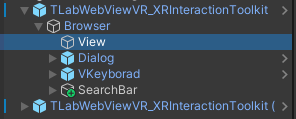
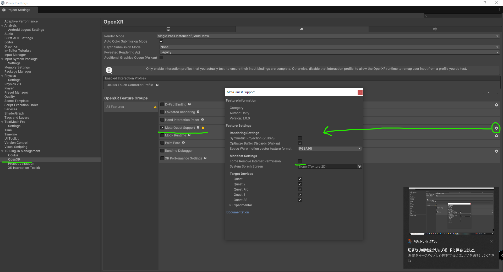

# TLabWebViewVR-XRInteractionToolkit-2022

## Overview
This sample Unity project is the minimum configuration for using [```TLabWebView```](https://github.com/TLabAltoh/TLabWebView) (3D web browser / 3D WebView plugin) with the [```XR Interaction Toolkit```](https://docs.unity3d.com/Packages/com.unity.xr.interaction.toolkit@2.5/manual/index.html). This includes searchbar example.

> [!NOTE]
> This repository will be public archived and rebuilt in the future. This project was originally upgraded from the Unity 2021 VR template to Unity 2022, so the XR Interaction Toolkit cannot be safely upgraded to 3.0.x. Currently, the XR Interaction Toolkit is kept at version 2.5.4.

> [!WARNING]
> Note that this project only works on Android devices; it will not display web pages when run on the Unity Editor.

> [!WARNING]
> I do not recommend building this project on Unity 6000.x when deploying to Oculus Quest (or Meta Quest). Right now, I have found that `HardwareBuffer` mode is unstable when this project is built with Unity 6000.x ([See this issue for details](https://github.com/TLabAltoh/TLabWebViewVR/issues/39)). If you do, please refer to the "Configuration for Unity 6000.x" section in the [Setup section](https://github.com/TLabAltoh/TLabWebViewVR?tab=readme-ov-file#set-up).

> [!WARNING]
> This project uses `HardwareBuffer` as the default `CaptureMode` for WebView and `Vulkan` is used as the default `Graphics API`. This combination of `HardwareBuffer` option and `Vulkan` API is confirmed to work with Oculus Quest, but may not work with some other devices (e.g., the WebView screen may go blank). In that case, Please change the project's `Graphics API` from `Vulkan`, which is set by default, to `OpenGLES`. Or change the `CaptureMode` from `HardwareBuffer` to `ByteBuffer`.
>
> <details>
> </img><br>
> </img>
> </details>

## Document
[Document is here](https://tlabgames.gitbook.io/tlabwebview/scripting-api)  
[Snippets is here](https://gist.github.com/TLabAltoh/e0512b3367c25d3e1ec28ddbe95da497#file-tlabwebview-snippets-md)

## Getting Started

### Requirements
- Unity Editor: 2022.3.19f1

### Installing
Clone the repository with the following command
```
git clone https://github.com/TLabAltoh/TLabWebViewVR-XRInteractionToolkit-2022.git

cd TLabWebViewVR-XRInteractionToolkit-2022

git submodule update --init
```

### Set Up
Please see the setup section [here](https://github.com/TLabAltoh/TLabWebView?tab=readme-ov-file#set-up)

<details><summary>When using the OpenXR plugin</summary>

Please disable `Force Remove Internet Permission` from XR Plugin Manegement

</img>

</details>